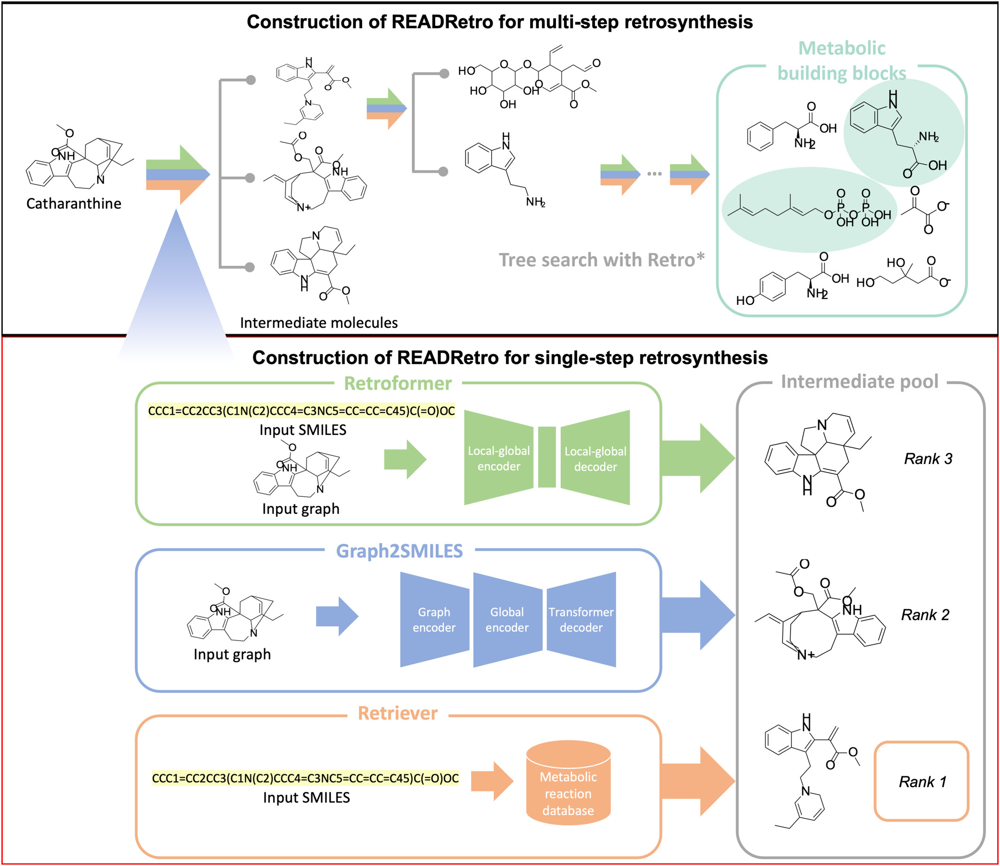

READRetro 
===================================
**READRetro (Retrieval-Augmented Dual-view Retrosynthesis)** is a practical bio-retrosynthesis tool designed to predict the biosynthetic pathways of plant natural products. Predicting these pathways is challenging but crucial for understanding plant ecology and biochemistry. READRetro integrates deep learning models and database retrieval methods to propose plausible biosynthetic routes from target molecules to metabolic building blocks.

Check out the :doc:`user_guide` section for further information, including
how to :ref:`installation` the project.

.. raw:: html

     

.. toctree::
   :caption: Contents

   quick_start_web
   quick_start_cli
   user_guide
